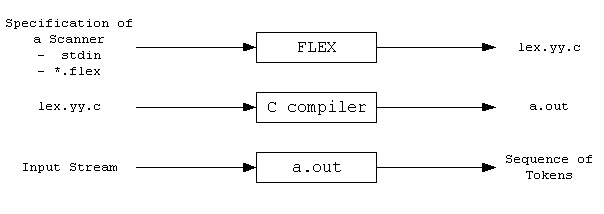

# Lab1 实验文档

<!-- TOC -->

- [Lab1 实验文档](#lab1-实验文档)
  - [0. 基础知识](#0-基础知识)
    - [0.1 cminus-f词法](#01-cminus-f词法)
    - [0.2 FLEX简单使用](#02-flex简单使用)
  - [1. 实验要求](#1-实验要求)
    - [1.1 目录结构](#11-目录结构)
    - [1.2 编译、运行和验证](#12-编译运行和验证)
    - [1.3 提交要求和评分标准](#13-提交要求和评分标准)

<!-- /TOC -->


## 0. 基础知识

在本次实验中我们讲重点用到`FLEX`和以`C-`为基础改编的`cminus-f`语言。这里对其进行简单介绍。

### 0.1 cminus-f词法

`C MINUS`是C语言的一个子集，该语言的语法在《编译原理与实践》第九章附录中有详细的介绍。而`cminus-f`则是在`C MINUS`上追加了浮点操作。

1. 关键字 

  ```
  else if int return void while float
  ```

2. 专用符号 

  ```
  + - * / < <= > >= == != = ; , ( ) [ ] { } /* */
  ```

3. 标识符ID和整数NUM，通过下列正则表达式定义:  

  ```
  letter = a|...|z|A|...|Z
  digit = 0|...|9
  ID = letter+
  INTEGER = digit+
  FLOAT = (digit+. | digit*.digit+)
  ```

4. 注释用`/*...*/`表示，可以超过一行。注释不能嵌套。 

  ```
  /*...*/
  ```

- 注：`[`,  `]`,  和 `[]` 是三种不同的token。`[]`用于声明数组类型，`[]`中间不得有空格。
  - `a[]`应被识别为两个token: `a`、`[]`
  - `a[1]`应被识别为四个token: `a`, `[`, `1`, `]`

### 0.2 FLEX简单使用

`FLEX`是一个生成词法分析器的工具。利用`FLEX`，我们只需提供词法的正则表达式，就可自动生成对应的C代码。整个流程如下图：



首先，`FLEX`从输入文件`*.lex`或者`stdio`读取词法扫描器的规范，从而生成C代码源文件`lex.yy.c`。然后，编译`lex.yy.c`并与`-lfl`库链接，以生成可执行的`a.out`。最后，`a.out`分析其输入流，将其转换为一系列token。

我们以一个简单的单词数量统计的程序wc.l为例: 

```c
%{
//在%{和%}中的代码会被原样照抄到生成的lex.yy.c文件的开头，您可以在这里书写声明与定义
#include <string.h>
int chars = 0;
int words = 0;
%}

%%
 /*你可以在这里使用你熟悉的正则表达式来编写模式*/
 /*你可以用C代码来指定模式匹配时对应的动作*/
 /*yytext指针指向本次匹配的输入文本*/
 /*左部分（[a-zA-Z]+）为要匹配的正则表达式，
 	右部分（{ chars += strlen(yytext);words++;}）为匹配到该正则表达式后执行的动作*/
[a-zA-Z]+ { chars += strlen(yytext);words++;}


. {}
 /*对其他所有字符，不做处理，继续执行*/

%%

int main(int argc, char **argv){
    //yylex()是flex提供的词法分析例程，默认读取stdin      
    yylex();                                                               
    printf("look, I find %d words of %d chars\n", words, chars);
    return 0;
}
```

使用Flex生成lex.yy.c

```bash
[TA@TA example]$ flex wc.l 
[TA@TA example]$ gcc lex.yy.c -lfl
[TA@TA example]$ ./a.out 
hello world
^D
look, I find 2 words of 10 chars
[TA@TA example]$ 
```

*注: 在以stdin为输入时，需要按下ctrl+D以退出* 

至此，你已经成功使用Flex完成了一个简单的分析器！

## 1. 实验要求

本次实验需要各位同学根据`cminux-f`的词法补全[lexical_analyer.l](../../src/lexer/lexical_analyzer.l)文件，完成词法分析器，能够输出识别出的`token`，`type` ,`line(刚出现的行数)`，`pos_start(该行开始位置)`，`pos_end(结束的位置,不包含)`。如：

文本输入：

```c
 int a;
```

则识别结果应为：

```shell
int     280     1       2       5
a       285     1       6       7
;       270     1       7       8
```
**具体的需识别token参考[lexical_analyzer.h](../../include/lexical_analyzer.h)**

**特别说明对于部分token，我们只需要进行过滤，即只需被识别，但是不应该被输出到分析结果中。因为这些token对程序运行不起到任何作用。**

> 注意，你所需修改的文件应仅有[lexical_analyer.l]../../src/lexer/lexical_analyzer.l)。关于`FLEX`用法上文已经进行简短的介绍，更高阶的用法请参考百度、谷歌和官方说明。

### 1.1 目录结构

整个`repo`的结构如下

```shell
.
├── CMakeLists.txt
├── Documentations
│   └── lab1
│       └── README.md  <- lab1实验文档说明
├── READMD.md
├── Reports
│   └── lab1
│       └── report.md  <- lab1所需提交的实验报告（你需要在此提交实验报告）
├── include <- 实验所需的头文件
│   └── lexical_analyzer.h 
├── src <- 源代码
│   └── lexer
│       ├── CMakeLists.txt
│       └── lexical_analyzer.l   <- flex文件，lab1所需完善的文件
└── tests	<- 测试文件
    └── lab1
        ├── CMakeLists.txt
        ├── main.c    <- lab1的main文件
        ├── test_lexer.py
        ├── testcase  <- 助教提供的测试样例
        └── TA_token  <- 助教提供的关于测试样例的词法分析结果
```

### 1.2 编译、运行和验证

`lab1`的代码大部分由`C`和`python`构成，使用`cmake`进行编译。

* 编译

  ```shell
  #进入workspace
  $ cd cminus_compiler-2021-fall
  #创建build文件夹，配置编译环境
  $ mkdir build 
  $ cd build 
  $ cmake ../
  #开始编译
  $ make
  ```

  编译成功将在`${WORKSPACE}/build/`下生成`lexer`命令

* 运行

  ```shell
  $ cd cminus_compiler-2021-fall
  # 运行lexer命令
  $ ./build/lexer
  usage: lexer input_file output_file
  # 我们可以简单运行下 lexer命令，但是由于此时未完成实验，当然输出错误结果
  $ ./build/lexer ./tests/lab1/testcase/1.cminus out
  [START]: Read from: ./tests/lab1/testcase/1.cminus
  [ERR]: unable to analysize i at 1 line, from 1 to 1
  ......
  ......

  $ head -n 5 out
  [ERR]: unable to analysize i at 1 line, from 1 to 1     258     1       1       1
  [ERR]: unable to analysize n at 1 line, from 1 to 1     258     1       1       1
  [ERR]: unable to analysize t at 1 line, from 1 to 1     258     1       1       1
  [ERR]: unable to analysize   at 1 line, from 1 to 1     258     1       1       1
  [ERR]: unable to analysize g at 1 line, from 1 to 1     258     1       1       1
  ```

  我们提供了`./tests/lab1/test_lexer.py` python脚本用于调用`lexer`批量完成分析任务。

  ```shell
  # test_lexer.py脚本将自动分析./tests/lab1/testcase下所有文件后缀为.cminus的文件，并将输出结果保存在./tests/lab1/token文件下下
  $ python3 ./tests/lab1/test_lexer.py
  	···
  	···
  	···
  #上诉指令将在./tests/lab1/token文件夹下产生对应的分析结果
  $ ls ./tests/lab1/token
  1.tokens  2.tokens  3.tokens  4.tokens  5.tokens  6.tokens
  ```

* 验证

  我们使用`diff`指令进行验证。将自己的生成结果和助教提供的`TA_token`进行比较。

  ```shell
  $ diff ./tests/lab1/token ./tests/lab1/TA_token
  # 如果结果完全正确，则没有任何输出结果
  # 如果有不一致，则会汇报具体哪个文件哪部分不一致
  ```

  **请注意助教提供的`testcase`并不能涵盖全部的测试情况，完成此部分仅能拿到基础分，请自行设计自己的`testcase`进行测试。**

### 1.3 提交要求和评分标准

* 提交要求

  本实验的提交要求分为两部分：实验部分的文件和报告，git提交的规范性。

  * 实验部分:

    * 需要完善`./src/lab1/lexical_analyer.l`文件;
    * 需要在`./Report/lab1/report.md`撰写实验报告。
    
      * 实验报告内容包括:
        * 实验要求、实验难点、实验设计、实验结果验证、实验反馈(具体参考[report.md](../../Reports/lab1/report.md));
        * 实验报告不参与评分标准，但是必须完成并提交.


  * git提交规范：

    * 不破坏目录结构(report.md所需的图片请放在`Reports/lab1/figs/`下);
    * 不上传临时文件(凡是自动生成的文件和临时文件请不要上传，包括`lex.yy.c`文件以及各位自己生成的`tokens`文件);
    * git log言之有物(不强制, 请不要git commit -m 'commit 1', git commit -m 'sdfsdf'，每次commit请提交有用的comment信息)
  
* 评分标准

  * git提交规范(20分);
  * 实现词法分析器并通过给出的6个测试样例(一个10分，共60分);
  * 提交后通过助教进阶的多个测试用例(20分)。


* 迟交规定

  * `Soft Deadline` : 【未定】

  * `Hard Deadline` : 【未定】

  * 补交请邮件提醒TA：  

    * 邮箱：shibc@hnu.edu.cn 
    * 邮件主题：lab1迟交-学号
    * 内容：包括迟交原因、最后版本commitID、迟交时间等

  * 迟交分数

    * x为迟交天数(对于`Soft Deadline`而言)，grade满分10 

      ```
      final_grade = grade, x = 0  
      final_grade = grade * (0.9)^x, 0 < x <= 7  
      final_grade = 0, x > 7
      ```

* 关于抄袭和雷同

  经过助教和老师判定属于作业抄袭或雷同情况，所有参与方一律零分，不接受任何解释和反驳。

        
如有任何问题，欢迎提issue进行批判指正。