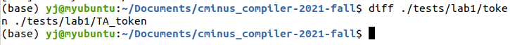

# lab1实验报告

201908010705 杨杰

## 实验要求

本次实验需要根据`cminux-f`的词法补全[lexical_analyer.l](../../src/lexer/lexical_analyzer.l)文件，完成词法分析器，能够输出识别出的`token`，`type` ,`line(刚出现的行数)`，`pos_start(该行开始位置)`，`pos_end(结束的位置,不包含)`。如：

文本输入：

```c
 int a;
```

则识别结果应为：

```shell
int     280     1       2       5
a       285     1       6       7
;       270     1       7       8
```

**具体的需识别token参考[lexical_analyzer.h](../../include/lexical_analyzer.h)**

**特别说明对于部分token，我们只需要进行过滤，即只需被识别，但是不应该被输出到分析结果中。因为这些token对程序运行不起到任何作用。**

> 注意，你所需修改的文件应仅有[lexical_analyer.l]../../src/lexer/lexical_analyzer.l)。关于`FLEX`用法上文已经进行简短的介绍，更高阶的用法请参考百度、谷歌和官方说明。

### 1.1 目录结构

整个`repo`的结构如下

```shell
.
├── CMakeLists.txt
├── Documentations
│   └── lab1
│       └── README.md  <- lab1实验文档说明
├── README.md
├── Reports
│   └── lab1
│       └── report.md  <- lab1所需提交的实验报告（你需要在此提交实验报告）
├── include <- 实验所需的头文件
│   └── lexical_analyzer.h 
├── src <- 源代码
│   └── lexer
│       ├── CMakeLists.txt
│       └── lexical_analyzer.l   <- flex文件，lab1所需完善的文件
└── tests <- 测试文件
    └── lab1
        ├── CMakeLists.txt
        ├── main.c    <- lab1的main文件
        ├── test_lexer.py
        ├── testcase  <- 助教提供的测试样例
        └── TA_token  <- 助教提供的关于测试样例的词法分析结果
```

### 1.2 编译、运行和验证

`lab1`的代码大部分由`C`和`python`构成，使用`cmake`进行编译。

* 编译

  ```shell
  # 进入workspace
  $ cd cminus_compiler-2021-fall
  
  # 创建build文件夹，配置编译环境
  $ mkdir build 
  $ cd build 
  $ cmake ../
  
  # 开始编译
  # 如果你只需要编译lab 1，请使用 make lexer
  $ make
  ```

  编译成功将在`${WORKSPACE}/build/`下生成`lexer`命令

* 运行

  ```shell
  $ cd cminus_compiler-2021-fall
  # 运行lexer命令
  $ ./build/lexer
  usage: lexer input_file output_file
  # 我们可以简单运行下 lexer命令，但是由于此时未完成实验，当然输出错误结果
  $ ./build/lexer ./tests/lab1/testcase/1.cminus out
  [START]: Read from: ./tests/lab1/testcase/1.cminus
  [ERR]: unable to analysize i at 1 line, from 1 to 1
  ......
  ......

  $ head -n 5 out
  [ERR]: unable to analysize i at 1 line, from 1 to 1     258     1       1       1
  [ERR]: unable to analysize n at 1 line, from 1 to 1     258     1       1       1
  [ERR]: unable to analysize t at 1 line, from 1 to 1     258     1       1       1
  [ERR]: unable to analysize   at 1 line, from 1 to 1     258     1       1       1
  [ERR]: unable to analysize g at 1 line, from 1 to 1     258     1       1       1
  ```

  我们提供了`./tests/lab1/test_lexer.py` python脚本用于调用`lexer`批量完成分析任务。

  ```shell
  # test_lexer.py脚本将自动分析./tests/lab1/testcase下所有文件后缀为.cminus的文件，并将输出结果保存在./tests/lab1/token文件下下
  $ python3 ./tests/lab1/test_lexer.py
    ···
    ···
    ···
  #上诉指令将在./tests/lab1/token文件夹下产生对应的分析结果
  $ ls ./tests/lab1/token
  1.tokens  2.tokens  3.tokens  4.tokens  5.tokens  6.tokens
  ```

* 验证

  我们使用`diff`指令进行验证。将自己的生成结果和助教提供的`TA_token`进行比较。

  ```shell
  $ diff ./tests/lab1/token ./tests/lab1/TA_token
  # 如果结果完全正确，则没有任何输出结果
  # 如果有不一致，则会汇报具体哪个文件哪部分不一致
  ```

  **请注意助教提供的`testcase`并不能涵盖全部的测试情况，完成此部分仅能拿到基础分，请自行设计自己的`testcase`进行测试。**

### 1.3 提交要求和评分标准

* 提交要求

  本实验的提交要求分为两部分：实验部分的文件和报告，git提交的规范性。

  * 实验部分:

    * 需要完善`./src/lab1/lexical_analyer.l`文件;
    * 需要在`./Report/lab1/report.md`撰写实验报告。

      * 实验报告内容包括:
        * 实验要求、实验难点、实验设计、实验结果验证、实验反馈(具体参考[report.md](../../Reports/lab1/report.md));
        * 实验报告推荐提交 PDF 格式。

  * git提交规范：

    * 不破坏目录结构(report.md所需的图片请放在`Reports/lab1/figs/`下);
    * 不上传临时文件(凡是自动生成的文件和临时文件请不要上传，包括`lex.yy.c`文件以及各位自己生成的`tokens`文件);
    * git log言之有物(不强制, 请不要git commit -m 'commit 1', git commit -m 'sdfsdf'，每次commit请提交有用的comment信息)

## 实验难点

本次实验的难点在于如何编写正则表达式使得完美匹配所有token，并计算token所在lines、pos_start、pos_end.

为了解决这些难题，我们需要先了解lex的常用语法，本次实验参考了[这篇博客](https://blog.csdn.net/wp1603710463/article/details/50365495)。

## 实验设计

我们可以把token分为算符、界符、关键字、标识符、常数、注释、空白、换行、错误九个类。  

* 算符包括+ - * / < <= > >= == != =  
* 界符包括; , ( ) [ ] { } []  
* 关键字包括else if int return void while float  
* 标识符定义为由英文字母组成的字符串  
* 常数包括整数和浮点数  
* 注释格式为/\*comment\*/  
* 空白包括[\f\r\t\v ]等  
* 换行为\n  
* 不满足上述描述的字符会报错

编写过程中需要注意的有以下几点：

* lex优先匹配最长、其次最先出现的正则表达式；
* 很多算符都是正则表达式中的特殊字符，在匹配时需要使用转义字符或者用""嵌套，如\+或者"+"均可；
* 界符中[ 、] 、[]应该当做3种token处理；
* 关键字区分大小写；
* 可以先将由英文字母组成的字符串匹配成标识符，再判断是否是关键字；
* 浮点数可以只含整数部分或只含小数部分，都要加小数点，如3.和.3都可以匹配成浮点数；
* 注释的处理比较复杂，我们需要考虑到单行注释和多行注释的情况，为了简化处理过程，这里使用状态来简化正则表达式。状态是lex支持的语法。

## 实验结果验证

* 原始测试样例  
  [1.cminus](../../tests/lab1/testcase/1.cminus)  
[2.cminus](../../tests/lab1/testcase/2.cminus)  
[3.cminus](../../tests/lab1/testcase/3.cminus)  
[4.cminus](../../tests/lab1/testcase/4.cminus)  
[5.cminus](../../tests/lab1/testcase/5.cminus)  
[6.cminus](../../tests/lab1/testcase/6.cminus)

  

  我们使用diff指令进行验证。将自己的生成结果和助教提供的TA_token进行比较。没有任何输出结果，说明结果完全正确。

* 自己编写的测试样例  
  [7.cminus](../../tests/lab1/testcase/7.cminus)  
  [8.cminus](../../tests/lab1/testcase/8.cminus)  
  [9.cminus](../../tests/lab1/testcase/9.cminus)

## 实验反馈

通过本次实验，我有了如下收获：

1. 熟悉了词法分析的基本原理，词法分析的过程，以及词法分析中要注意的一些问题。
2. 学会了使用lex自动生成词法分析器的方法。
3. 复习了正则表达式的用法。
4. 学习了有限状态机的构造方法。
