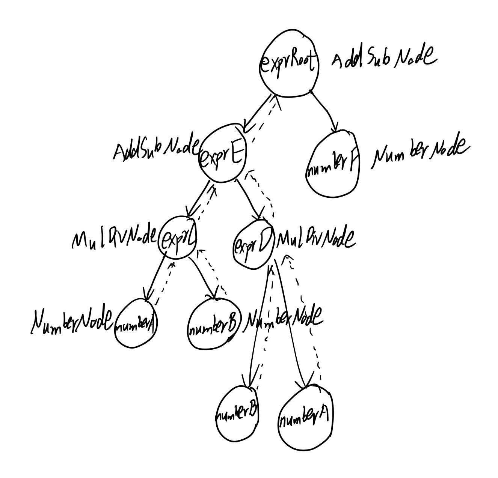

# lab3 实验报告
201908010705 杨杰


## 问题1: cpp与.ll的对应
请描述你的cpp代码片段和.ll的每个BasicBlock的对应关系。描述中请附上两者代码。

**解答**

```cpp
// assign_generator.cpp

#include "BasicBlock.h"
#include "Constant.h"
#include "Function.h"
#include "IRBuilder.h"
#include "Module.h"
#include "Type.h"

#include <iostream>
#include <memory>

#ifdef DEBUG  // 用于调试信息,大家可以在编译过程中通过" -DDEBUG"来开启这一选项
#define DEBUG_OUTPUT std::cout << __LINE__ << std::endl;  // 输出行号的简单示例
#else
#define DEBUG_OUTPUT
#endif

#define CONST_INT(num) \
    ConstantInt::get(num, module)

#define CONST_FP(num) \
    ConstantFP::get(num, module) // 得到常数值的表示,方便后面多次用到

int main() {
  auto module = new Module("Cminus code");  // module name是什么无关紧要
  auto builder = new IRBuilder(nullptr, module);
  
  Type *Int32Type = Type::get_int32_type(module);   //define Int32Type
  auto *arrayType = ArrayType::get(Int32Type, 10);  //define arrayType
  
  // main函数
  auto mainFun = Function::create(FunctionType::get(Int32Type, {}),
                                  "main", module);
  auto bb = BasicBlock::create(module, "entry", mainFun);
  // BasicBlock的名字在生成中无所谓,但是可以方便阅读
  builder->set_insert_point(bb);  // 一个BB的开始,将当前插入指令点的位置设在bb
  auto arrayAlloca = builder->create_alloca(arrayType);  //为a[10]分配空间

  auto a0GEP = builder->create_gep(arrayAlloca, {CONST_INT(0), CONST_INT(0)});  //计算a[0]地址
  builder->create_store(CONST_INT(10), a0GEP);                                  //a[0] = 10
  auto a0Load = builder->create_load(a0GEP);
  auto mul = builder->create_imul(a0Load, CONST_INT(2));                        //a[0] * 2
  auto a1GEP = builder->create_gep(arrayAlloca, {CONST_INT(0), CONST_INT(1)});  //计算a[1]地址
  builder->create_store(mul, a1GEP);                                            //a[1] = a[0] * 2
  auto a1Load = builder->create_load(a1GEP);               
  builder->create_ret(a1Load);
  std::cout << module->print();
  delete module;
  return 0;
}
```

```python
;assign_hand.ll

; ModuleID = 'assign.c'
source_filename = "assign.c"
target datalayout = "e-m:e-p270:32:32-p271:32:32-p272:64:64-i64:64-f80:128-n8:16:32:64-S128"
target triple = "x86_64-pc-linux-gnu"

; Function Attrs: noinline nounwind optnone uwtable
define dso_local i32 @main() #0 {
  %1 = alloca [10 x i32]  ;为数组分配空间
  %2 = getelementptr inbounds [10 x i32], [10 x i32]* %1, i64 0, i64 0  ;计算a[0]地址
  store i32 10, i32* %2   ;a[0] = 10
  %3 = load i32, i32* %2
  %4 = mul nsw i32 2, %3  ;a[0] * 2
  %5 = getelementptr inbounds [10 x i32], [10 x i32]* %1, i64 0, i64 1  ;计算a[1]地址
  store i32 %4, i32* %5   ;a[1] = a[0] * 2
  ret i32 %4
}

attributes #0 = { noinline nounwind optnone uwtable "correctly-rounded-divide-sqrt-fp-math"="false" "disable-tail-calls"="false" "frame-pointer"="all" "less-precise-fpmad"="false" "min-legal-vector-width"="0" "no-infs-fp-math"="false" "no-jump-tables"="false" "no-nans-fp-math"="false" "no-signed-zeros-fp-math"="false" "no-trapping-math"="false" "stack-protector-buffer-size"="8" "target-cpu"="x86-64" "target-features"="+cx8,+fxsr,+mmx,+sse,+sse2,+x87" "unsafe-fp-math"="false" "use-soft-float"="false" }

!llvm.module.flags = !{!0}
!llvm.ident = !{!1}

!0 = !{i32 1, !"wchar_size", i32 4}
!1 = !{!"clang version 10.0.0-4ubuntu1 "}
```


## 问题2: Visitor Pattern

请指出visitor.cpp中，`treeVisitor.visit(exprRoot)`执行时，以下几个Node的遍历序列:numberA、numberB、exprC、exprD、exprE、numberF、exprRoot。
序列请按如下格式指明：
exprRoot->numberF->exprE->numberA->exprD

**解答**

要弄清Node的遍历序列首先要理解```node.leftNode.accept(*this)``` ```treeVisitor.visit(*this)```中的*this代表什么。

遍历序列为：exprRoot->exprE->exprC->numberA->numberB->exprD->numberB->numberA->numberF



## 问题3: getelementptr
请给出`IR.md`中提到的两种getelementptr用法的区别,并稍加解释:
  - `%2 = getelementptr [10 x i32], [10 x i32]* %1, i32 0, i32 %0` 

  - `%2 = getelementptr i32, i32* %1, i32 %0` 

**解答**

前者用于结构体元素地址计算，后者只是数组元素地址计算。

详见参考链接：https://www.kancloud.cn/digest/xf-llvm/162268


## 实验要求

* 第一部分：了解LLVM IR。通过clang生成的.ll，了解LLVM IR与c代码的对应关系。完成1.3

* 第二部分：了解LightIR。通过助教提供的c++例子，了解LightIR的c++接口及实现。完成2.3

* 第三部分：理解Visitor Pattern。

* 实验报告：在[report.md](https://gitee.com/gunshi3/cminus_compiler-2021-fall/blob/master/Reports/lab3/report.md)中回答3个问题。

  

## 实验设计

* 根据`clang -S -emit-llvm gcd_array.c`指令，你可以得到对应的`gcd_array.ll`文件。你需要结合[gcd_array.c](https://gitee.com/gunshi3/cminus_compiler-2021-fall/blob/master/tests/lab3/ta_gcd/gcd_array.c)阅读`gcd_array.ll`，理解其中每条LLVM IR指令与c代码的对应情况。
  通过`lli gcd_array.ll; echo $?`指令，你可以测试`gcd_array.ll`执行结果的正确性。其中，

  - `lli`会运行`*.ll`文件
  - `$?`的内容是上一条命令所返回的结果，而`echo $?`可以将其输出到终端中

* 在`tests/lab3/stu_ll/`目录中，手工完成自己的[assign_hand.ll](https://gitee.com/gunshi3/cminus_compiler-2021-fall/blob/master/tests/lab3/stu_ll/assign_hand.ll)、[fun_hand.ll](https://gitee.com/gunshi3/cminus_compiler-2021-fall/blob/master/tests/lab3/stu_ll/fun_hand.ll)、[if_handf.ll](https://gitee.com/gunshi3/cminus_compiler-2021-fall/blob/master/tests/lab3/stu_ll/if_hand.ll)和[while_hand.ll](https://gitee.com/gunshi3/cminus_compiler-2021-fall/blob/master/tests/lab3/stu_ll/while_hand.ll)，以实现与上述四个C程序相同的逻辑功能。

* 学会`LightIR`接口的使用，助教提供了[tests/lab3/ta_gcd/gcd_array_generator.cpp](https://gitee.com/gunshi3/cminus_compiler-2021-fall/blob/master/tests/lab3/ta_gcd/gcd_array_generator.cpp)。该cpp程序会生成与gcd_array.c逻辑相同的LLVM IR文件。

* 在`tests/lab3/stu_cpp/`目录中，编写[assign_generator.cpp](https://gitee.com/gunshi3/cminus_compiler-2021-fall/blob/master/tests/lab3/stu_cpp/assign_generator.cpp)、[fun_generator.cpp](https://gitee.com/gunshi3/cminus_compiler-2021-fall/blob/master/tests/lab3/stu_cpp/fun_generator.cpp)、[if_generator.cpp](https://gitee.com/gunshi3/cminus_compiler-2021-fall/blob/master/tests/lab3/stu_cpp/if_generator.cpp)和[while_generator.cpp](https://gitee.com/gunshi3/cminus_compiler-2021-fall/blob/master/tests/lab3/stu_cpp/while_generator.cpp)，以生成与1.3节的四个C程序相同逻辑功能的`.ll`文件。

* Visitor Pattern(访问者模式)是一种在LLVM项目源码中被广泛使用的设计模式。你需要理解`visitor.cpp`中tree是如何被遍历的。

  

## 实验结果验证

* .ll验证

  
*  .cpp验证


## 实验反馈

通过本次实验，我有了如下收获：

1. 了解了LLVM IR。通过clang生成的.ll，了解LLVM IR与c代码的对应关系以及如何编写.ll文件。
2. 了解了LightIR。通过助教提供的c++例子，了解LightIR的c++接口及实现。学会了如何编写.cpp文件，以生成.ll文件。
3. 对编译阶段中的中间代码生成有了更深一步的理解。
4. 学习了Visitor Pattern(访问者模式)。
5. 复习了C++中this指针的用法。